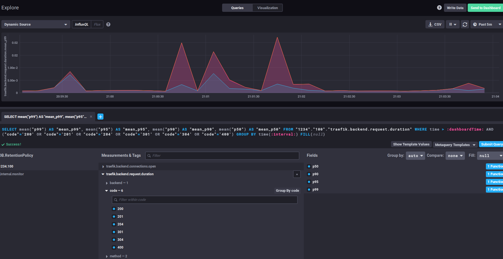

# traefik-influxdb-chronograf-monitoring
Monitoring Traefik metrics with InfluxDB and Chronograf
<<<<<<< HEAD

=======

Using Chronograf and InfluxDB to monitor Traefik's metrics.  

Still woking on this but it works.  
>>>>>>> 9990e9d6bf0458c6f0e2454fe3b9cf085499370b
